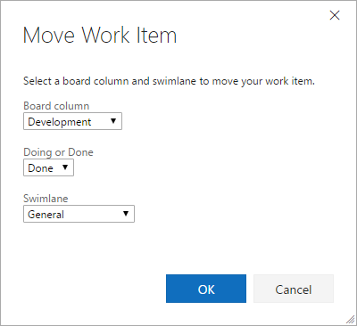
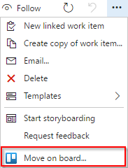

# Move Work Items on Board from Work Item Form

> Currently only available on TFS 2017 or later and Visual Studio Team Services. 



# Help your team move work items on the board from the work item form's context menu 


# Source code 

The [source](https://github.com/mikebranstein/vsts-extension-board-form) for this extension can be found on Github - feel free to take, fork and extend. 

You can also learn how to build your own custom control extension for the work item form [here](https://www.visualstudio.com/en-us/docs/integrate/extensions/develop/custom-control). 

# Feedback 

We need your feedback! Here are some ways to connect with us:

* Add a review below.
* Report issues in [GitHub](https://github.com/mikebranstein/vsts-extension-board-form/issues).

# To Use

Install TypeScript & Gulp:

```
> npm install -g typescript gulp
```

Install node modules:

```
npm install
```

## To Compile

To test compilation, you can run `gulp transpile-ts`. You should receive no errors.

